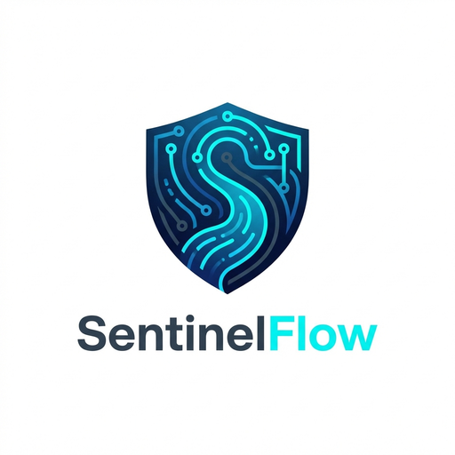
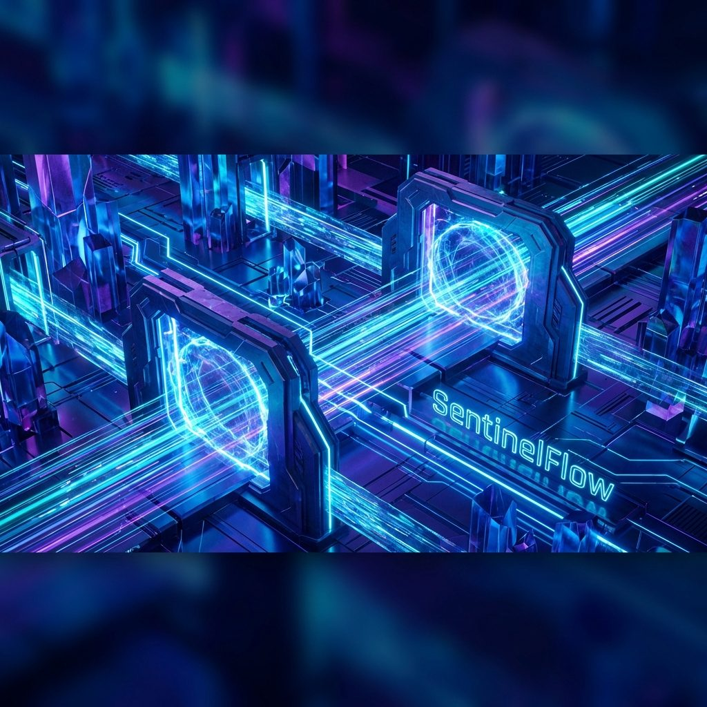
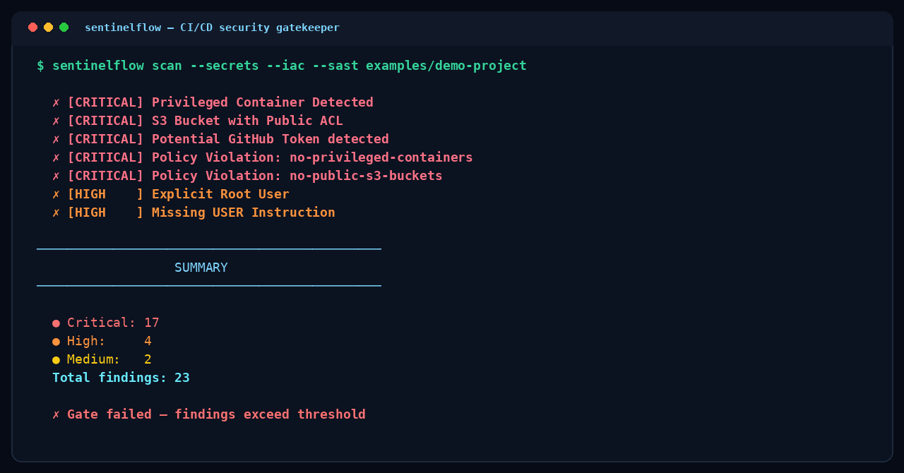
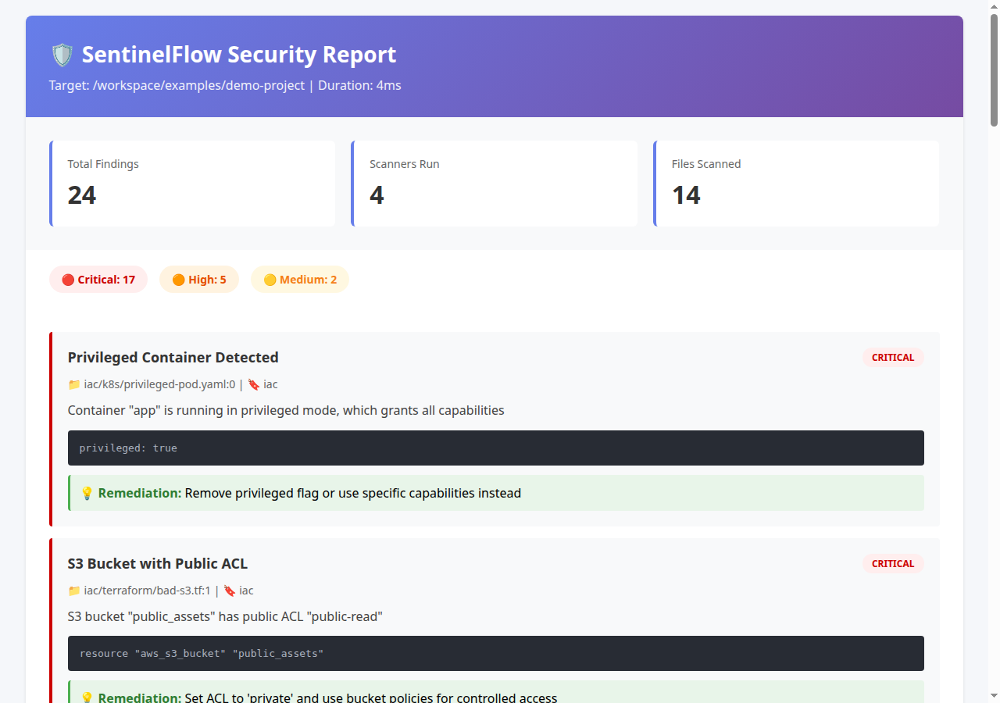
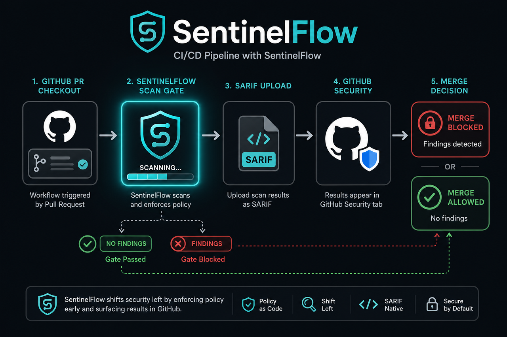

# SentinelFlow

<p align="center">
  
</p>

<p align="center">
  <strong>CI/CD Security Gatekeeper</strong><br/>
  Secrets · IaC · Dependencies · SAST · Policy · SBOM — one binary for the pipeline.
</p>

<p align="center">
  <a href="https://github.com/cozyGarage/sentielflow/actions/workflows/security-scan.yml"></a>
  <a href="https://github.com/cozyGarage/sentielflow/releases"></a>
  <a href="https://hub.docker.com/r/sentinelflow/sentinelflow"></a>
  <a href="LICENSE"></a>
</p>

<p align="center">
  
</p>

SentinelFlow scans your repo for leaked secrets, insecure infrastructure, vulnerable dependencies, and policy violations — then fails the build when gates trip.

## See it in action

<p align="center">
  
</p>

<p align="center">
  
</p>

| Pipeline gate | Shift-left workflow |
| :---: | :---: |
|  |  |

### 60-second demo

```bash
# From a clone
make demo

# Or Docker (no Go toolchain)
docker run --rm -v "$PWD:/workspace" -w /workspace \
  sentinelflow/sentinelflow:latest \
  scan --secrets --iac --sast examples/demo-project
```

`make demo` scans [`examples/demo-project`](examples/demo-project) (intentional findings) and writes `demo-out/report.{html,md,sarif}`.

Checked-in samples: [`docs/assets/demo/`](docs/assets/demo/).

## Install

| Method | Best for | How |
| --- | --- | --- |
| **Docker** | CI & local tryouts | `docker pull sentinelflow/sentinelflow:latest` |
| **Install script** | Laptops | `curl -fsSL https://raw.githubusercontent.com/cozyGarage/sentielflow/main/scripts/install.sh \| bash` |
| **GitHub Action** | Pull requests | `delivery: docker` (see below) |
| **Go install** | Go developers | `go install github.com/cozygarage/sentinelflow/cmd/sentinelflow@latest` |
| **Source** | Contributors | `make build` |

### Docker

```bash
docker run --rm -v "$PWD:/workspace" -w /workspace \
  sentinelflow/sentinelflow:latest \
  scan --all --format sarif -o report.sarif
```

Compose helpers: [`docker-compose.yml`](docker-compose.yml) (`scan-html`, `scan-sarif`, `scan-markdown`).

### Release binary

```bash
# Latest release → ./bin/sentinelflow
curl -fsSL https://raw.githubusercontent.com/cozyGarage/sentielflow/main/scripts/install.sh | bash
./bin/sentinelflow version

# Pin a version
VERSION=1.0.0 curl -fsSL https://raw.githubusercontent.com/cozyGarage/sentielflow/main/scripts/install.sh | bash
```

### GitHub Action (Docker delivery)

```yaml
- uses: cozyGarage/sentielflow/.github/actions/sentinelflow@main
  with:
    delivery: docker
    image: sentinelflow/sentinelflow:latest
    scan-all: 'true'
    fail-on: high
    format: sarif
    output: report.sarif
```

`delivery: build` (default) compiles from source when you want bleeding-edge `main`.

## Features

- **Secret scanning** — tokens, passwords, entropy, optional git history
- **Infrastructure-as-Code** — Terraform, Kubernetes, Dockerfiles
- **Dependencies** — OSV lookup (Go/npm/PyPI/Maven/Cargo)
- **SAST** — OWASP-oriented static patterns
- **Container** — Trivy when available
- **License policy** — deny GPL/AGPL/SSPL-style licenses
- **Policy-as-code** — embedded OPA/Rego built-ins
- **SBOM** — CycloneDX
- **Reports** — text, Markdown, SARIF, JSON, HTML

> AI-powered review is **planned**. `--ai` / `scanners.ai.enabled` are rejected in this release.

## Configuration

```yaml
version: "1.0"
scanners:
  secrets: { enabled: true }
  iac:
    enabled: true
    frameworks: [terraform, kubernetes, dockerfile]
  dependencies: { enabled: true, ecosystems: [auto] }
fail_on:
  severity: high
  secrets: true
  policy_violations: true
```

Full reference: [docs/configuration.md](docs/configuration.md).

## CI/CD

```yaml
name: Security Scan
on: [pull_request]
jobs:
  security:
    runs-on: ubuntu-latest
    permissions:
      contents: read
      security-events: write
    steps:
      - uses: actions/checkout@v4
        with:
          fetch-depth: 0
      - uses: cozyGarage/sentielflow/.github/actions/sentinelflow@main
        with:
          delivery: docker
          fail-on: high
          format: sarif
          output: report.sarif
      - uses: github/codeql-action/upload-sarif@v3
        if: always()
        with:
          sarif_file: report.sarif
```

GitLab (container):

```yaml
sentinelflow:
  image: sentinelflow/sentinelflow:latest
  script:
    - sentinelflow scan --all --format sarif -o gl-security-report.sarif
  artifacts:
    reports:
      sast: gl-security-report.sarif
```

More: [docs/cicd-integration.md](docs/cicd-integration.md).

## Documentation

- [Usage](docs/usage.md) · [Configuration](docs/configuration.md) · [Scanners](docs/scanners.md)
- [Policies](docs/policies.md) · [CI/CD](docs/cicd-integration.md) · [Architecture](docs/architecture.md)

## Development

```bash
go test ./...
make build
make demo
make scan-self
```

## Security

- Findings are redacted; secrets are not stored or exfiltrated
- Scanning is local by default (OSV receives package names/versions only)
- Container image runs as a non-root user

## License

MIT — see [LICENSE](LICENSE).
