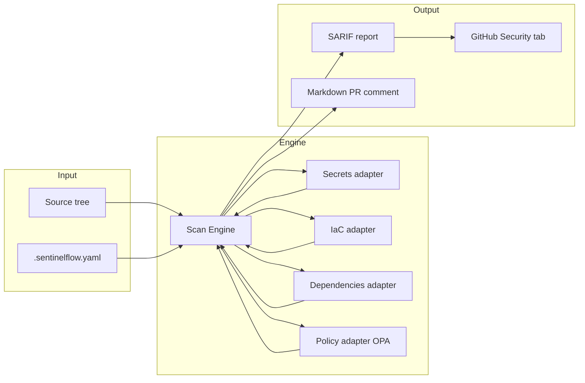

# SentinelFlow

[](https://github.com/cozyGarage/sentielflow/actions/workflows/security-scan.yml)

**CI/CD Security Gatekeeper**

SentinelFlow is a security scanning tool that integrates with CI/CD pipelines to detect leaked secrets, insecure infrastructure configurations, vulnerable dependencies, and policy violations.

## Features

- **Secret Scanning**: Detect leaked API keys, tokens, passwords, and credentials
- **Infrastructure-as-Code**: Scan Terraform, Kubernetes, and Dockerfile configurations
- **Dependency Analysis**: Check for vulnerable dependencies via the OSV API
- **Policy Enforcement**: OPA-based policy-as-code validation
- **Multiple Report Formats**: Text, Markdown, SARIF, JSON, and HTML output

> **Note:** AI-powered code review is configured in `.sentinelflow.yaml` but not yet implemented in the scanner engine.

## Quick Start

### Installation

```bash
# Build from source
git clone https://github.com/cozygarage/sentinelflow
cd sentinelflow
go build -o sentinelflow ./cmd/sentinelflow

# Or use Make (Windows: sentinelflow.exe)
make build
```

### Basic Usage

```bash
# Initialize configuration
sentinelflow init

# Run all scanners
sentinelflow scan --all

# Scan specific types
sentinelflow scan --secrets --iac

# Generate SARIF report for GitHub
sentinelflow scan --all --format sarif -o report.sarif

# Generate Markdown report for PR comments
sentinelflow scan --all --format markdown -o report.md
```

## Configuration

Create a `.sentinelflow.yaml` file in your project root (or run `sentinelflow init`):

```yaml
version: "1.0"

scanners:
  secrets:
    enabled: true
    allowlist:
      - "test/**"
      - "**/*_test.go"
    entropy_threshold: 4.5

  iac:
    enabled: true
    frameworks:
      - terraform
      - kubernetes
      - dockerfile

  dependencies:
    enabled: true
    ecosystems:
      - auto
    severity: medium

  ai:
    enabled: false  # Not yet implemented

policies:
  enabled: true
  builtin:
    - no-public-s3-buckets
    - no-privileged-containers
    - require-https

fail_on:
  severity: high
  secrets: true
```

See [Configuration Reference](docs/configuration.md) for all options.

## CI/CD Integration

### GitHub Actions

```yaml
name: Security Scan
on: [pull_request]

jobs:
  security:
    runs-on: ubuntu-latest
    permissions:
      contents: read
      security-events: write
    steps:
      - uses: actions/checkout@v4
        with:
          fetch-depth: 0

      - uses: cozyGarage/sentielflow/.github/actions/sentinelflow@main
        with:
          scan-all: 'true'
          fail-on: high
          format: sarif
          output: report.sarif

      - uses: github/codeql-action/upload-sarif@v3
        if: always()
        with:
          sarif_file: report.sarif
```

### GitLab CI

```yaml
sentinelflow:
  image: golang:1.24
  script:
    - go build -o sentinelflow ./cmd/sentinelflow
    - ./sentinelflow scan --all --format sarif -o gl-security-report.sarif
  artifacts:
    reports:
      sast: gl-security-report.sarif
```

See [CI/CD Integration](docs/cicd-integration.md) for more examples.

## Architecture

SentinelFlow follows a pipeline-oriented design: a central scan engine orchestrates adapters, aggregates findings, and emits SARIF for the GitHub Security tab.



| Layer | Responsibility |
| --- | --- |
| **Scan engine** | File discovery, concurrent scanner dispatch, result aggregation |
| **Adapters** | Secrets, IaC (Terraform/K8s/Dockerfile), dependencies (OSV), OPA policies |
| **Reporter** | SARIF, JSON, Markdown, HTML — SARIF uploads integrate with GitHub Advanced Security |

See [ARCHITECTURE.md](ARCHITECTURE.md) and [docs/architecture.md](docs/architecture.md) for deeper diagrams.

## Compliance & Pipeline Integration

SentinelFlow is designed as a **shift-left security gate** suitable for regulated environments. It maps cleanly to common control themes without storing or exfiltrating discovered secrets.

| Control theme | SentinelFlow capability | Framework alignment |
| --- | --- | --- |
| **Secrets & credential hygiene** | Regex + entropy scanning, CI fail-on-secrets | PCI-DSS Req. 3 & 8 (protect stored credentials; identify users) |
| **Secure configuration** | IaC scanning for Terraform, Kubernetes, Dockerfiles | PCI-DSS Req. 2 (secure configurations); DORA ICT risk management |
| **Dependency & supply-chain risk** | Lockfile parsing + OSV vulnerability lookup | DORA Art. 6 (ICT risk management); PCI-DSS Req. 6 (secure development) |
| **Policy-as-code enforcement** | OPA/Rego gates (e.g. no privileged containers, HTTPS required) | DORA operational resilience testing; internal change-control policies |
| **Audit trail** | SARIF artifacts uploaded to GitHub Security; SBOM generation in CI | Demonstrates evidence collection for audit and incident response |

**Pipeline integration pattern:** run `sentinelflow scan --all --format sarif` on every pull request, upload SARIF to the platform security tab, and block merge when severity thresholds are exceeded. The included [`.github/workflows/security-scan.yml`](.github/workflows/security-scan.yml) workflow implements this end-to-end (scan → SARIF upload → PR comment → SBOM job).

## Scanners

| Scanner | Description |
| --- | --- |
| **Secrets** | Regex patterns, entropy analysis, and keyword heuristics |
| **IaC** | Terraform, Kubernetes manifests, and Dockerfiles |
| **Dependencies** | Lockfile parsing with OSV vulnerability lookup |
| **Policy** | Built-in and custom OPA/Rego policies |

## CLI Commands

| Command | Description |
| --- | --- |
| `sentinelflow scan` | Run security scanners |
| `sentinelflow init` | Create default configuration |
| `sentinelflow policy list` | List built-in policies |
| `sentinelflow policy generate` | Create a new policy template |
| `sentinelflow version` | Print version information |

## Documentation

- [Usage Guide](docs/usage.md)
- [Configuration Reference](docs/configuration.md)
- [Scanner Documentation](docs/scanners.md)
- [CI/CD Integration](docs/cicd-integration.md)
- [Writing Custom Policies](docs/policies.md)
- [Architecture](docs/architecture.md)

## Development

```bash
# Run tests
go test ./...

# Run integration tests
go test -tags=integration ./test/...

# Build
go build -o sentinelflow ./cmd/sentinelflow

# Run locally
./sentinelflow scan --all --verbose
```

## Security

- **No secret storage**: Never stores or transmits discovered secrets
- **Local processing**: All scanning happens locally by default
- **Minimal permissions**: CI integration requires only read access to code

## Contributing

Contributions are welcome. See [CONTRIBUTING.md](CONTRIBUTING.md) for guidelines.

## Acknowledgments

Built with:

- [Cobra](https://github.com/spf13/cobra) — CLI framework
- [Viper](https://github.com/spf13/viper) — Configuration management
- [OPA](https://www.openpolicyagent.org/) — Policy engine
- [go-sarif](https://github.com/owenrumney/go-sarif) — SARIF support
