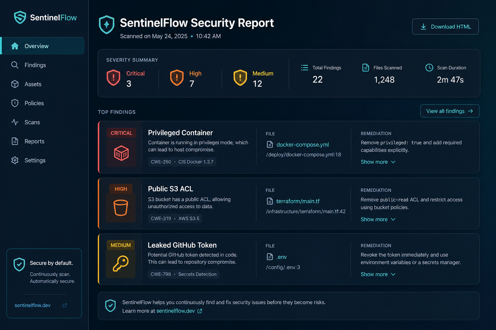
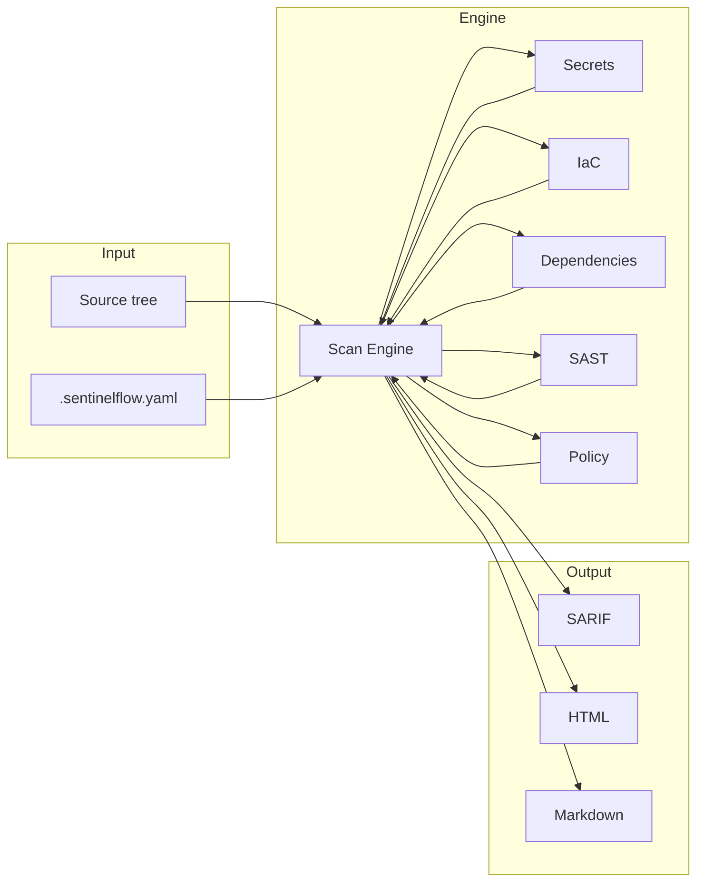

# SentinelFlow

<p align="center">
  
</p>

<p align="center">
  <strong>CI/CD Security Gatekeeper</strong><br/>
  Secrets · IaC · Dependencies · SAST · Policy · SBOM — one binary for the pipeline.
</p>

<p align="center">
  <a href="https://github.com/cozyGarage/sentielflow/actions/workflows/security-scan.yml"></a>
  <a href="https://github.com/cozyGarage/sentielflow/releases"></a>
  <a href="https://hub.docker.com/r/sentinelflow/sentinelflow"></a>
  <a href="LICENSE"></a>
</p>

<p align="center">
  
</p>

SentinelFlow scans your repo for leaked secrets, insecure infrastructure, vulnerable dependencies, and policy violations — then fails the build when gates trip.

## See it in action

<p align="center">
  
</p>

<p align="center">
  
</p>

<p align="center">
  
</p>

<p align="center">
  
</p>

<p align="center">
  
</p>

### 60-second local demo

```bash
# Docker (no Go toolchain required)
docker run --rm -v "$PWD:/workspace" -w /workspace \
  sentinelflow/sentinelflow:latest \
  scan --secrets --iac --sast examples/demo-project

# Or from a clone
make demo
```

`make demo` builds the binary, scans [`examples/demo-project`](examples/demo-project) (intentional findings), and writes:

- `demo-out/report.html`
- `demo-out/report.md`
- `demo-out/report.sarif`

Sample HTML/Markdown reports are also checked in under [`docs/assets/demo/`](docs/assets/demo/).

## Install — pick your delivery path

| Method | Best for | Command |
| --- | --- | --- |
| **Docker** | CI, local tryouts | `docker pull sentinelflow/sentinelflow:latest` |
| **GitHub Release** | Laptops / air-gapped runners | Download from [Releases](https://github.com/cozyGarage/sentielflow/releases) |
| **GitHub Action** | Pull requests | `uses: cozyGarage/sentielflow/.github/actions/sentinelflow@main` |
| **Go install** | Go developers | `go install github.com/cozygarage/sentinelflow/cmd/sentinelflow@latest` |
| **Build from source** | Contributors | `make build` |

### Docker

```bash
docker pull sentinelflow/sentinelflow:latest

docker run --rm -v "$PWD:/workspace" -w /workspace \
  sentinelflow/sentinelflow:latest \
  scan --all --format sarif -o report.sarif
```

Compose helpers are in [`docker-compose.yml`](docker-compose.yml) (`scan-html`, `scan-sarif`, `scan-markdown`).

### GitHub Release binary

```bash
# Example: Linux amd64 — replace VERSION with a release tag (e.g. 1.0.0)
VERSION=1.0.0
curl -sL "https://github.com/cozyGarage/sentielflow/releases/download/v${VERSION}/sentinelflow_${VERSION}_linux_amd64.tar.gz" \
  | tar -xz
./sentinelflow version
```

Windows/macOS/arm64 archives are published by GoReleaser on every `v*` tag.

### GitHub Action (Docker delivery)

Prefer the published image instead of compiling Go on every job:

```yaml
- uses: cozyGarage/sentielflow/.github/actions/sentinelflow@main
  with:
    delivery: docker
    image: sentinelflow/sentinelflow:latest
    scan-all: 'true'
    fail-on: high
    format: sarif
    output: report.sarif
```

`delivery: build` (default) still compiles from source when you want bleeding-edge `main`.

## Features

- **Secret scanning** — tokens, passwords, entropy, optional git history
- **Infrastructure-as-Code** — Terraform, Kubernetes, Dockerfiles
- **Dependencies** — OSV vulnerability lookup across Go/npm/PyPI/Maven/Cargo
- **SAST** — OWASP-oriented static patterns
- **Container** — Trivy integration when available
- **License policy** — deny GPL/AGPL/SSPL-style licenses
- **Policy-as-code** — embedded OPA/Rego built-ins
- **SBOM** — CycloneDX output
- **Reports** — text, Markdown, SARIF, JSON, HTML

> AI-powered review is **planned**. `--ai` / `scanners.ai.enabled` are rejected in this release.

## Configuration

```yaml
version: "1.0"
scanners:
  secrets: { enabled: true }
  iac:
    enabled: true
    frameworks: [terraform, kubernetes, dockerfile]
  dependencies: { enabled: true, ecosystems: [auto] }
fail_on:
  severity: high
  secrets: true
  policy_violations: true
```

Full reference: [docs/configuration.md](docs/configuration.md).

## CI/CD

### GitHub Actions + SARIF

```yaml
name: Security Scan
on: [pull_request]
jobs:
  security:
    runs-on: ubuntu-latest
    permissions:
      contents: read
      security-events: write
    steps:
      - uses: actions/checkout@v4
        with:
          fetch-depth: 0
      - uses: cozyGarage/sentielflow/.github/actions/sentinelflow@main
        with:
          delivery: docker
          scan-all: 'true'
          fail-on: high
          format: sarif
          output: report.sarif
      - uses: github/codeql-action/upload-sarif@v3
        if: always()
        with:
          sarif_file: report.sarif
```

### GitLab CI (container)

```yaml
sentinelflow:
  image: sentinelflow/sentinelflow:latest
  script:
    - sentinelflow scan --all --format sarif -o gl-security-report.sarif
  artifacts:
    reports:
      sast: gl-security-report.sarif
```

More examples: [docs/cicd-integration.md](docs/cicd-integration.md).

## Architecture



## Documentation

- [Usage](docs/usage.md) · [Configuration](docs/configuration.md) · [Scanners](docs/scanners.md)
- [Policies](docs/policies.md) · [CI/CD](docs/cicd-integration.md) · [Architecture](docs/architecture.md)

## Development

```bash
go test ./...
make build
make demo
make scan-self
```

## Security

- Findings are redacted; secrets are not stored or exfiltrated
- Scanning is local by default (OSV receives package names/versions only)
- Container image runs as a non-root user

## License

MIT — see [LICENSE](LICENSE).
