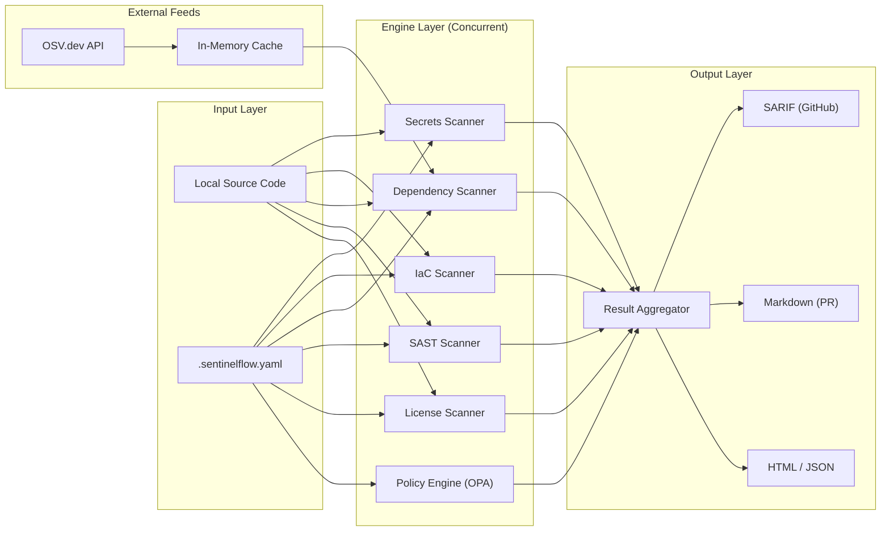
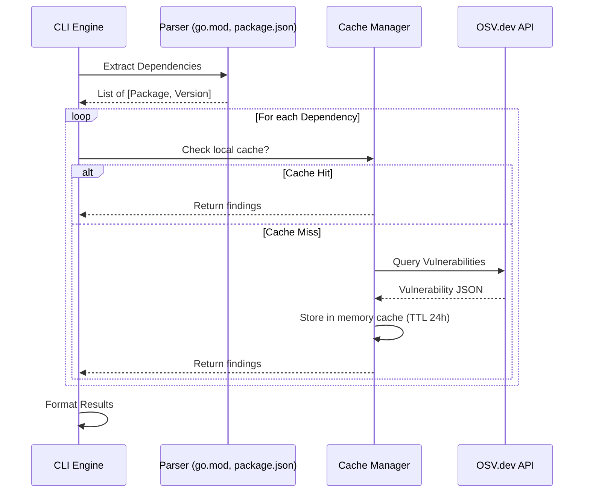
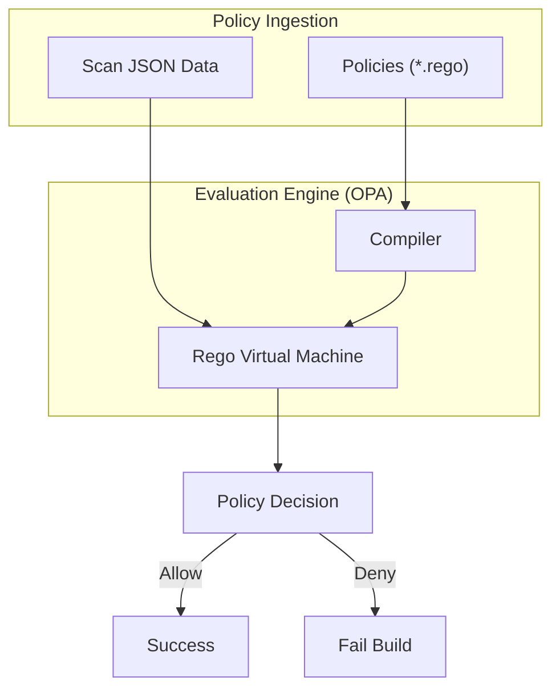
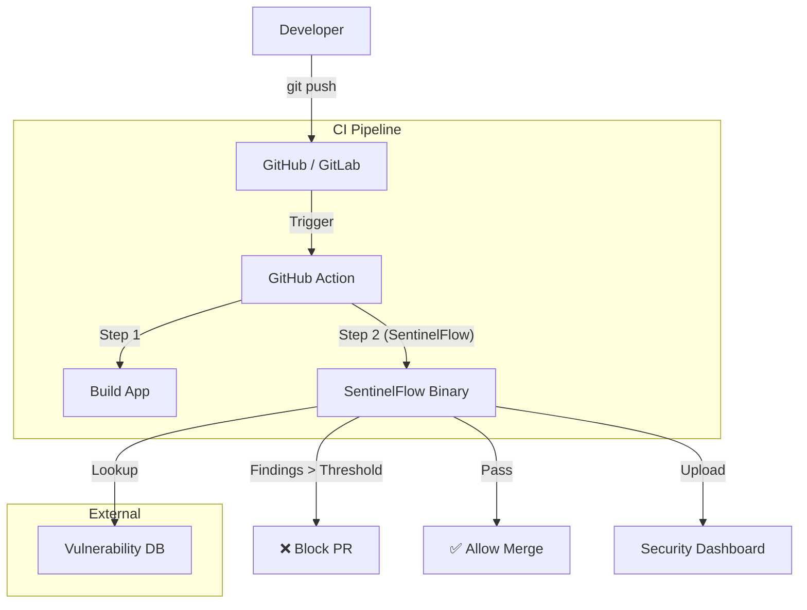

# System Architecture: SentinelFlow

This document explains the internal architecture of SentinelFlow v1.0 using high-level system design patterns.

---

## 1. High-Level Scan Pipeline

The scanning process follows a structured pipeline: ingestion, concurrent analysis, policy evaluation, and reporting.

### Security Insight:

- **Isolation**: Scanners run in parallel but do not share state, preventing a malicious file from affecting the analysis of another.
- **Caching**: The local cache reduces network calls, making the tool faster and more resistant to rate-limiting or API downtime.

---

## 2. Dependency Scanner Flow

How we identify vulnerabilities in third-party packages without executing their code.

### Security Insight:

- **Version Range Matching**: We use semver comparison to see if your version falls within the "affected range" provided by the vulnerability database.

---

## 3. Policy-as-Code (OPA) Integration

SentinelFlow uses Open Policy Agent (OPA) to allow users to write custom security rules in the **Rego** language.

### Security Insight:

- **Context-Aware**: OPA doesn't just look for strings; it analyzes the _state_ of your infrastructure. For example: "Fail if an S3 bucket is public AND does not have encryption enabled."

---

## 4. CI/CD Integration Architecture

How SentinelFlow acts as a security gatekeeper in a modern DevOps environment.

---

## 5. Security Principles of SentinelFlow

1.  **Zero Trust Pattern**: We don't trust any input file. Each is treated as potentially malicious or misconfigured.
2.  **Defense in Depth**: We use multiple scanning layers (Secrets + IaC + Deps) because a single vulnerability often spans multiple areas.
3.  **Local First**: Sensitive data never leaves your environment. We only send package names/versions to the vulnerability database—never your source code.
4.  **Static over Dynamic**: We analyze the code _before_ it runs (SAST), which is safer than running it and observing behavior (DAST) for a build-time tool.
