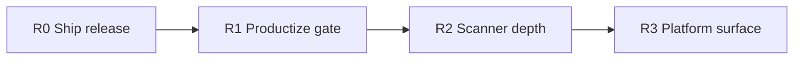

# SentinelFlow Roadmap

Post–audit baseline (`main` after #10–#14): multi-scanner gate is **trustworthy for CI dogfood**, delivery plumbing is ready, but **no published `v*` release** yet and several scanner surfaces remain intentionally thin.

This roadmap orders work by leverage for a CI security gatekeeper—not by calendar estimates.

---

## North star

One binary / one Action that teams trust to **fail builds on real risk** without false greens, silent skips, or install friction.

---

## Current baseline (done)

| Theme | Status |
| --- | --- |
| Engine correctness (findings-on-error, fail gates, exclude vs allowlist) | Done (Wave 1) |
| Delivery hardening (Action env binding, install checksums, pinned GoReleaser) | Done (Wave 2) |
| Scanner honesty / FN–FP hygiene (policy/IaC align, scoped skips, redact) | Done (Wave 3) |
| CI unit tests + configurable `scan_timeout` | Done (#13/#14) |
| First GitHub Release + Docker Hub image | **Not shipped** |
| Module path = GitHub repo (`sentinelflow` vs `sentielflow`) | Deferred |

Residual detail: [audit-residual-risks.md](audit-residual-risks.md). Release steps: [releasing.md](releasing.md).

---

## R0 — Ship the product (highest priority)

**Goal:** Advertised install paths work against a real tag.

| Work | Why | Acceptance |
| --- | --- | --- |
| Confirm `DOCKER_USERNAME` / `DOCKER_PASSWORD` on the repo (optional for binaries) | Hub images; binaries ship without them | Secrets present **or** release uses `--skip=docker` |
| Tag `v1.1.0` from current `main` | Unblocks `install.sh` (+ Docker when secrets exist) | GitHub Release + `checksums.txt` (+ Hub tags if configured) |
| Verify install (+ Docker pull when published) | Prove the happy path | `VERSION=… ./scripts/install.sh`; optional `docker run … version` |
| Point README/Action defaults at the tag (not only `:latest`) | Reproducible CI | Docs/examples use `v1.1.0` (or keep `:latest` with a note) |
| Close the “until first release” story in README/CHANGELOG | Honest → shipped | Unreleased audit notes folded under the release section |

**Out of R0:** module/repo rename (do in R1 if it blocks `go install` messaging).

---

## R1 — Productize the gate

**Goal:** External repos adopt the Action without surprises; CI stays green under flaky deps.

| Work | Why | Acceptance |
| --- | --- | --- |
| Align Go module path with GitHub repo **or** stop implying Go module install forever | Removes the last broken install claim | One clear install matrix (binary / Docker / Action / optional `go install`) |
| Action: optional `timeout` input wired to `--timeout` | Parity with CLI | Documented; dogfood uses it if needed |
| Soften OSV flake without false greens | Network blips red CI today | Config: e.g. `dependencies.fail_on_error` / retry / cache; default stays strict for security |
| Container-in-Docker story | `scan-container` requires `delivery=build` | Documented path **or** Trivy-in-image / sidecar design spike |
| Baseline UX polish | Teams need suppressions | `baseline` create/update docs + one Action example |
| SARIF upload defaults in Action docs | GitHub code scanning consumers | Copy-paste workflow snippet that uploads on `always()` |

---

## R2 — Scanner depth (quality over breadth)

**Goal:** Raise signal on surfaces users already enable; stay honest where incomplete.

| Work | Why | Acceptance |
| --- | --- | --- |
| License: SBOM-backed or richer DB **or** keep “limited map” and demote default-on in `--all` | Current map = high FN | Either real coverage or defaults match honesty |
| Dependencies: Ruby/Gemfile **or** keep unsupported | Claim gap closed | Parser + OSV ecosystem **or** docs-only forever |
| CloudFormation (or explicit “not planned”) | Listed as planned IaC gap | Minimal rule set **or** remove from roadmap language |
| Policy ↔ IaC drift suite | Prevent silent divergence | Fixture matrix: same privileged/init cases for both |
| Secrets: entropy/pattern tuning + more fixtures | Core value prop | Measured FP drop on demo + self-scan |
| SAST: move intentional patterns out of production sources | Self-scan exclude is a workaround | Patterns in data files; scanner loads them |
| Redact: structured secret fields, not only snippet heuristics | Defense in depth | Secret findings never emit raw match groups in any format |

**Defer unless pulled forward:** AI code review (keep rejected until a real design).

---

## R3 — Platform surface

**Goal:** SentinelFlow as a small platform, not only a CLI.

| Work | Why | Acceptance |
| --- | --- | --- |
| OSV worker pool / rate limit / offline vulndb refresh | Scale + CI stability | Configurable concurrency; documented rate behavior |
| Findings identity + diff across runs | PR comments / trends | Stable IDs; optional “new vs baseline” summary |
| Multi-repo / monorepo path filters | Enterprise layouts | `include`/`exclude` with clear precedence docs |
| Plugin or custom rule packs (beyond Rego files) | Extensibility without forks | Documented extension point **or** “Rego-only” decision |
| Signed releases (cosign) + Action pin-by-digest docs | Supply chain story | Cosign verify in install notes |
| Performance budget on large repos | Real monorepos | Benchmark + documented guidance (concurrency, exclude) |

---

## Explicit non-goals (near term)

- Rewriting the engine in another language
- Full cloud CSPM (AWS/GCP live APIs)
- Replacing Trivy with an in-house container CVE engine
- Marketplace “AI autofix” without a scoped design

---

## Suggested sequence

1. **R0** — cut `v1.1.0` (unblocks everything else users see).
2. **R1** — module-path decision + Action/timeout/OSV flake + container story.
3. **R2** — license/deps/IaC/policy depth; remove self-scan exclude workaround for SAST patterns.
4. **R3** — platform, signing, monorepo, identity.

Re-run the [audit loop](audit-residual-risks.md) after each release train; keep residual risks short and current.

---

## Success metrics (per release train)

| Metric | Target |
| --- | --- |
| Self-scan (`scan --all --fail-on high`) | Exit 0 on `main` |
| Unit + script CI | Required checks green |
| Install path | `install.sh` verifies checksum against the new tag |
| Action dogfood | External-style `delivery: docker` works against the release image |
| Honesty | No README/Action claim for unimplemented scanners |
